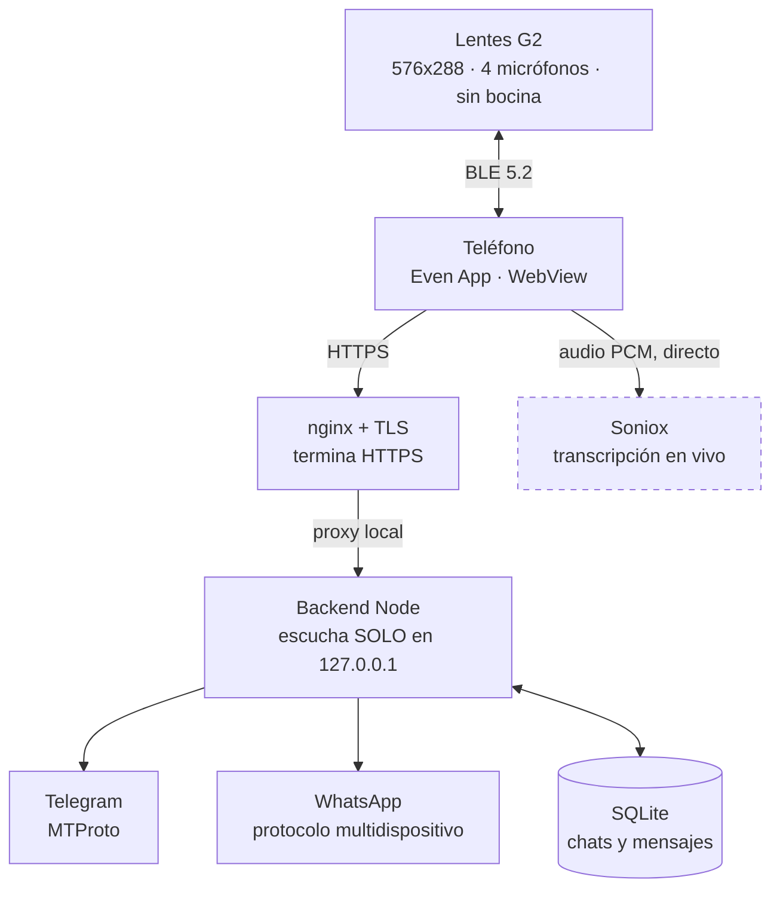
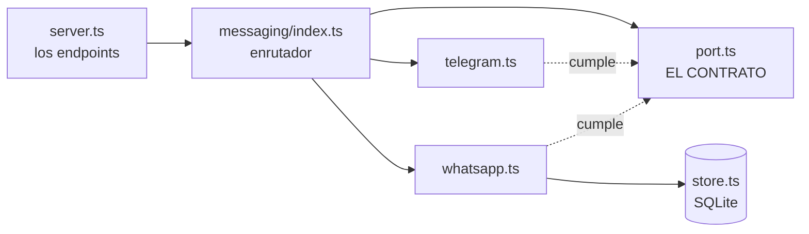
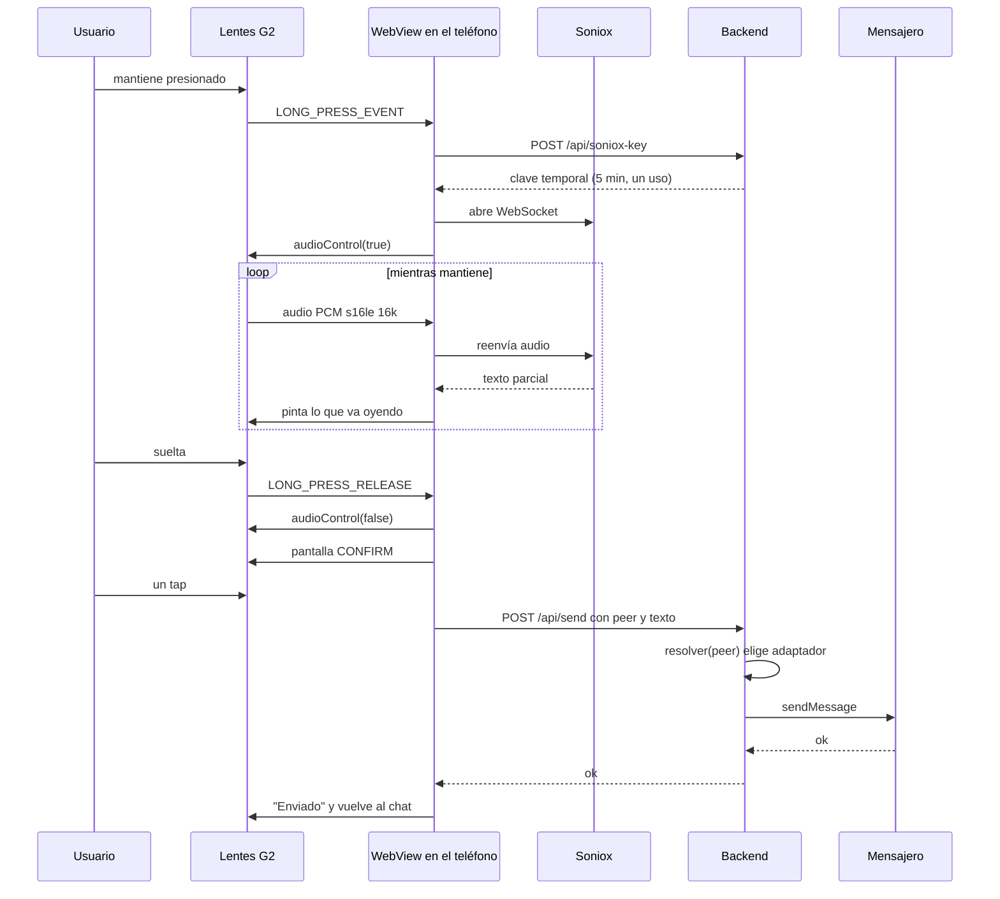
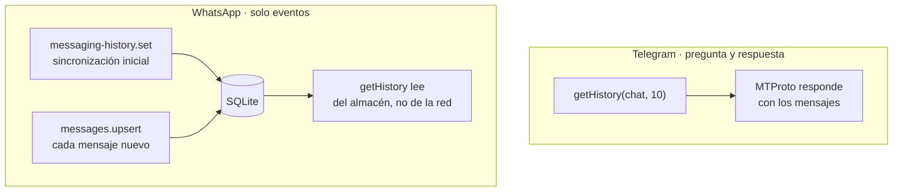
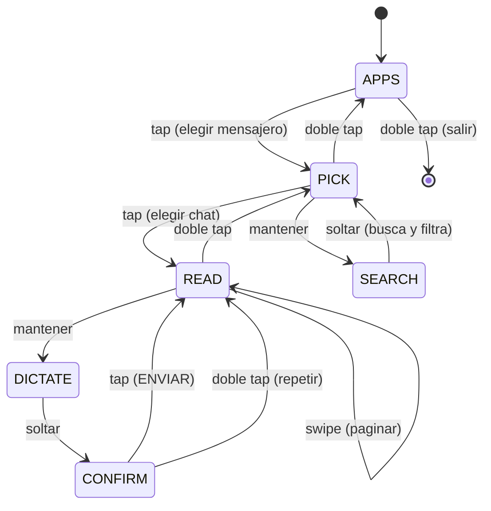
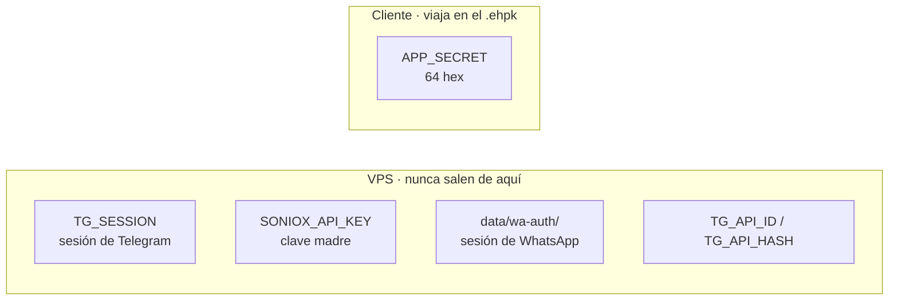

# Arquitectura de VozGram

Cómo está armado por dentro: qué depende de qué, por dónde viaja cada cosa y
por qué se decidió así. El [README](../README.md) explica cómo usarlo; esto
explica cómo funciona.

---

## Panorama



Las dos flechas que salen del teléfono son la clave del diseño:

- **El audio va directo a Soniox.** Nunca toca el backend. Por el servidor solo
  circula texto ya transcrito.
- **El texto va al backend.** Que es quien habla con Telegram y WhatsApp.

Esto no es una optimización: es lo que evita que tu voz cruce tu propio
servidor, y lo que hace que el dictado no dependa de que el backend aguante el
caudal de audio.

---

## Las tres piezas

| Pieza | Dónde corre | Qué hace |
|---|---|---|
| `glasses/` | WebView en el teléfono | Dibuja el HUD, lee el touchpad, captura el micrófono |
| `backend/` | VPS, servicio systemd | Acuña claves de Soniox y habla con los mensajeros |
| Lentes G2 | Hardware | Pantalla y micrófonos; **no ejecutan código propio** |

El detalle que sorprende a todos: **la app no corre en los lentes.** Corre en el
teléfono, y el SDK envía por BLE lo que hay que dibujar. Los lentes son una
pantalla y unos micrófonos, no una computadora.

---

## Dependencias, y por qué cada una

### Backend

| Paquete | Versión | Para qué | Por qué esa |
|---|---|---|---|
| `telegram` (GramJS) | ^2.26 | Cliente MTProto | Telegram **sí** ofrece API oficial para cuentas personales. Raro y valioso |
| `baileys` | `7.0.0-rc14` | Cliente de WhatsApp | Ver la nota de abajo |
| `express` | ^5 | Servidor HTTP | 6 endpoints, nada exótico |
| `express-rate-limit` | ^8.7 | Tope de peticiones | Maneja subredes IPv6, que a mano se hace mal |
| `cors` | ^2.8 | Cabeceras CORS | El WebView de iOS usa un origin impredecible |
| `dotenv` | ^17 | Carga el `.env` | — |
| `node:sqlite` | *incluido* | Almacén de WhatsApp | **Cero dependencias**: viene con Node 22+ |

**Sobre la versión de Baileys.** Se fija `7.0.0-rc14` **exacta**, y es un
*release candidate*. Suena mal hasta que ves las fechas:

```
6.17.16  "estable"   2025-03    hace más de un año
7.0.0-rc14            2026-07    semanas
```

Baileys no implementa un estándar público: es **ingeniería inversa de un
protocolo que Meta cambia cuando quiere.** En una biblioteca así, *viejo y
estable* no significa seguro — significa desactualizado y probablemente roto.
Por eso el RC, y por eso clavado a la versión exacta: entre RCs sí se rompen
cosas.

**Y un detalle que tumba el servidor si se ignora**: Baileys arrastra
`whatsapp-rust-bridge`, que es **solo-ESM** (su `package.json` no declara
condición `require`). Este backend es CommonJS, así que un `import` estático
hace fallar el arranque **y se lleva puesto a Telegram**. Por eso se carga con
`await import('baileys')` dentro de la función. De regalo: sus 9 MB solo entran
a memoria si alguien usa WhatsApp.

### Lentes

| Paquete | Versión | Para qué |
|---|---|---|
| `@evenrealities/even_hub_sdk` | ^0.0.14 | Puente con los lentes: dibujar, eventos, micrófono |
| `vite` | ^8 | Servidor de desarrollo y compilación |
| `evenhub-cli` | ^0.1 | Empaqueta el `.ehpk` |
| `evenhub-simulator` | ^0.9 | Simulador de escritorio con API de automatización |

El simulador **no es un juguete**: expone una API HTTP que permite recorrer la
app entera sin hardware. Encontró un `DUPLICATE_Z_ORDER_INDEX` en diez segundos
que en los lentes habría costado una ceremonia completa de portal.

---

## El contrato: puertos y adaptadores



`port.ts` no tiene implementación: solo declara **qué debe saber hacer un
mensajero.**

```typescript
interface MessagingProvider {
  readonly id: string
  readonly label: string
  listContacts(limit?: number, q?: string): Promise<Contact[]>
  getHistory(peer: string, limit?: number): Promise<Msg[]>
  sendMessage(peer: string, text: string): Promise<void>
}
```

Es el enchufe de la pared: **la pared define la forma, no qué aparato conectas.**

Consecuencia medible: agregar WhatsApp entero costó **dos líneas** en el código
existente —registrar el adaptador— y `server.ts` no se tocó.

### Los ids viajan opacos

Cada chat viaja prefijado con su mensajero:

```
telegram:12345
whatsapp:5215512345678@s.whatsapp.net
```

**Los lentes nunca interpretan ese id**: lo reciben y lo devuelven. Por eso
sumar un mensajero **no exigió reconstruir el `.ehpk`** — apareció en unos
lentes ya instalados, sin ceremonia de portal.

Un id **sin** prefijo se enruta a Telegram. Eso no es cortesía: es lo que evitó
romper la app que ya estaba instalada, que manda ids sin prefijar.

---

## Flujo: mandar un mensaje



Tres decisiones visibles ahí:

1. **La clave de Soniox es temporal y de un solo uso.** La clave madre nunca
   sale del servidor.
2. **El micrófono se enciende al mantener y se apaga al soltar.** Nunca escucha
   solo. No es una preferencia: es la diferencia entre una herramienta y un
   micrófono abierto en tu cara.
3. **Al enviar se vuelve al chat, no al menú.** Acabas de escribir: quieres ver
   la respuesta.

---

## Flujo: recibir mensajes

Aquí Telegram y WhatsApp **no se parecen en nada**, y eso explica media
arquitectura.



**Telegram te deja preguntar.** `getMessages(chat, {limit})` devuelve los
mensajes. Punto.

**WhatsApp no.** `fetchMessageHistory` devuelve `Promise<string>` — un
identificador de solicitud, **no los mensajes** — y exige un mensaje viejo que
ya tengas. Los mensajes **llegan solos** por eventos, y si no los guardas se
pierden para siempre.

Por eso el adaptador de WhatsApp escribe todo en SQLite y lee de ahí. Telegram
no necesita almacén; WhatsApp no funciona sin él.

**Consecuencia práctica:** el backend tiene que estar **conectado** para
recibir. Por eso conecta al arrancar y no espera un pedido HTTP, y por eso hay
un vigilante que revisa cada 60 segundos si el socket murió —porque **puede
morir sin emitir el evento de cierre** y dejar de recibir en silencio.

---

## La máquina de estados de los lentes



Con **un solo mensajero** configurado, `APPS` se salta: un menú de un elemento
es un paso regalado. En ese caso `PICK` es la raíz y su doble tap sale.

Restricción del SDK que condiciona todo esto: **un solo contenedor por página
puede capturar eventos.** Lista y texto no conviven capturando; se cambia de
página con `rebuildPageContainer`.

---

## Dónde vive cada secreto



| Secreto | Dónde | Si se filtra |
|---|---|---|
| `TG_SESSION` | VPS, `.env` chmod 600 | **Control total** de tu Telegram. No expira |
| `data/wa-auth/` | VPS, chmod 600 | **Control total** de tu WhatsApp |
| `SONIOX_API_KEY` | VPS | Se cobra por uso |
| `APP_SECRET` | **viaja en el cliente** | Acceso a tu backend |

El `APP_SECRET` está en el `.ehpk` porque el cliente tiene que autenticarse de
algún modo. **Un secreto dentro de un paquete distribuido es ofuscación, no
seguridad** — es un tradeoff aceptado por ser una app privada de un solo
usuario, y es la razón principal por la que el modelo multiusuario sigue
parqueado.

---

## Superficie expuesta

| Endpoint | Auth | Qué hace |
|---|---|---|
| `GET /health` | ninguna | `{"ok":true}` |
| `POST /api/soniox-key` | `x-app-secret` | Clave temporal de Soniox |
| `GET /api/providers` | `x-app-secret` | Mensajeros activos |
| `GET /api/contacts` | `x-app-secret` | Chats, con filtro y búsqueda |
| `GET /api/messages` | `x-app-secret` | Historial de un chat |
| `POST /api/send` | `x-app-secret` | Envía |

Defensas: el backend escucha **solo en loopback** (la única entrada es nginx con
TLS), el rate limit va **antes** de la autenticación —para que quien no tiene el
secreto tope con el límite en vez de generar 401s gratis sin fin— y
`trust proxy` está en `1`, no en `true`.

**Ese `1` importa.** Detrás de nginx todos los sockets llegan desde `127.0.0.1`;
sin `trust proxy` el limitador metería a internet entera en un solo balde y el
primer curioso dejaría al dueño fuera de su propia app. Y `true` aceptaría
cualquier `X-Forwarded-For` inventado, que es exactamente cómo se salta un
límite.

---

## Restricciones del hardware que se ven en el código

Están explicadas en el [README](../README.md#restricciones-del-hardware-que-condicionan-el-diseño).
Las que más forma le dieron a este diseño:

- **Protobuf omite los ceros**: el índice 0 de una lista llega como `undefined`.
  El `?? 0` no es defensivo, es obligatorio.
- **Nunca dos llamadas al bridge en paralelo**: comparten el enlace BLE. Van
  serializadas en cadena y con timeout.
- **La pantalla se llena por renglones renderizados**, no por caracteres. La
  paginación cuenta `ceil(largo / ancho)`.
- **`zOrderIndex` debe estar en todos los contenedores de la página y además no
  puede repetirse.**
